# HamiVisualizer

HamiVisualizer 是一个面向科研、课堂演示和模型检查的桌面哈密顿量可视化工具。它用
Python 3.12、PySide6 和 SymPy 把“格点—跃迁—边界条件—参数”组织成一个可编辑模型，
并在同一工作区中查看矩阵、晶格连线、能带和有限体系波函数。

当前版本：**0.4.0**（模型 JSON 格式为 version 1）。项目按开源软件的文档、测试和发布流程维护；
仓库尚未单独声明最终许可证，正式发布前请根据维护者的选择补充 `LICENSE` 文件。

> 完整文档以本文件为准。`README-v0.3.md` 仅作为旧链接兼容入口，不再是发布入口。

## 目录

- [适用对象与典型场景](#适用对象与典型场景)
- [功能概览](#功能概览)
- [安装与启动](#安装与启动)
- [五分钟上手](#五分钟上手)
- [完整工作流教程](#完整工作流教程)
- [模型与物理语义](#模型与物理语义)
- [界面操作与快捷键](#界面操作与快捷键)
- [输入、校验与错误处理](#输入校验与错误处理)
- [性能边界](#性能边界)
- [开发、测试与截图验收](#开发测试与截图验收)
- [项目结构](#项目结构)
- [版本、变更与发布](#版本变更与发布)
- [故障排查](#故障排查)
- [文档规范依据](#文档规范依据)

## 适用对象与典型场景

### 目标用户

- 需要快速核对 tight-binding / Bloch 模型矩阵结构的研究人员；
- 讲授晶格、能带、边界态的教师和学生；
- 希望在提交论文或代码前检查格点编号、胞内/胞间跃迁和边界条件的开发者。

### 典型场景

1. 从方格、蜂窝、Kagome、SSH 或 Haldane 模板开始，调节 `t`、`phi` 等参数并观察结果。
2. 在半无限 ribbon 中检查 `kx` 相位、胞间跃迁和三列周期虚影的连线。
3. 在双开边界（OBC）中调节 SSH 的 `t1/t2` 与能量，查看两端局域态和体态差异。
4. 编辑自定义斜原胞、格点和跃迁，使用矩阵与表格交叉核对模型。
5. 保存 `.hvisual`，在多个模型标签之间切换，或用分屏比较不同模型。

## 功能概览

### 工作区与模型管理

- 顶层标签支持同时打开、复制、重命名、关闭和拖动排序多个模型；每个标签独立保存参数、
  结果页、视图缩放与平移状态。
- “文件 → 新建模型”提供 NP、SC、空白自定义、方格、一维链、SSH、Haldane、蜂窝、三角
  和 Kagome 模板；Kagome 另有“新建 Kagome 三角纳米盘”快捷入口。
- “文件 → 打开最近模型”从 `~/.hvisual/models/` 读取最近记录；损坏或不存在的记录会被
  安全跳过，可在菜单中清空记录。
- “视图 → 分屏比较”打开两个结果视窗；模型数据可同步，两个视窗的缩放和平移互不干扰。
- 模型默认保存为 `~/.hvisual/models/*.hvisual`，工作区和偏好分别保存为
  `~/.hvisual/workspace.json`、`~/.hvisual/preferences.json`。也可另存为独立 JSON 文件。

### 矩阵视图

- MATLAB 风格排版：矩阵区域不显示外层括号，单元格按色块表达 onsite、胞内和胞间项。
- 上、下、左、右四边都有行列标尺；标尺固定在视口边缘，放大矩阵内部后仍能知道当前行列。
- 使用 Qt 原生数学文本渲染 Bloch 项，例如 `e^{ik_x}` 中的 `k_x` 为真正下标；足够放大
  时显示文本，缩小时自动隐藏细节以保持流畅。
- 滚轮、`+/-` 和 `0`（适应窗口）控制矩阵视图；左键拖拽只在空白画布上平移，点击矩阵元只
  负责选择和显示详情，不会偷偷开始拖动。

### 晶格与编辑器

- 物理坐标以 y 轴向上绘制；界面可见格点编号从 **1** 开始，内部计算仍采用 Python 的
  0-based 索引并在表格中保持一致映射。
- 普通浏览不会改动模型。进入“编辑晶格”后，必须显式选择“添加格点”或“添加跃迁”；
  拖动格点默认吸附网格，按住 `Alt` 可自由移动，`Delete` 删除当前选中格点/跃迁。
- 半无限模式开启“添加跃迁”后，可直接从中心格点点到左右虚影格点，程序转换为整数胞偏移
  `dx/dy`；“胞内/胞间”和“其他关系…”菜单以及左侧表格提供精确检查和长程项兜底。
- “系数：全部显示”把跃迁系数输入框集中在右侧导轨。密集模型默认收起引线，悬停跃迁或
  聚焦输入框时只显示当前项的斜向+横向导引，避免满屏交叉线。
- 编辑工具栏提供“吸附”“恢复编辑前构型”“撤销/重做”；默认最多保留 10 步，可在偏好
  设置中调整。恢复构型只恢复进入编辑态前的几何，不会删除仍有效的参数或跃迁。

### 预设与物理视图

| 预设 | 用途 | 特色 |
| --- | --- | --- |
| NP / SC | 与 MATLAB 原型对拍 | 保留历史基底顺序，适合验证矩阵 |
| 方格 / 一维链 | 入门和边界测试 | 结构简单，适合检查偏移与 Hermitian 共轭 |
| 蜂窝 | 石墨烯类模型 | 斜原胞、最近邻/次近邻和 Bloch 相位 |
| 三角 | 三角晶格 | 适合观察三角边界与规则连线 |
| Kagome | 三角网络与纳米盘 | 普通矩形/半无限 ribbon；三角盘使用 3 格点斜原胞和三条平直等边边界 |
| SSH | 一维拓扑边界态 | 双开边界调小 `t1`、调大 `t2` 可观察两端局域态 |
| Haldane | 复次近邻相位 | 同一蜂窝斜原胞加入 `±phi` 与质量项 `m`，可检查复矩阵和开隙能带 |

当前稳定支持单轨道标量 Hermitian 哈密顿量、半无限/OBC、固定相位跃迁、符号/数值/智能
矩阵、能带、OBC 本征态、JSON 存取，以及 PNG、SVG、PDF 导出。SVG/PDF 会把当前标签页
（含矩阵标尺、晶格/能带/波函数和当前主题）直接绘制到矢量画布，适合论文排版与后续编辑。
暂不支持内部自旋/轨道矩阵、非 Hermitian
模型、二维 PBC、圆柱边界、半元胞和 Chern 数自动计算。

## 安装与启动

### 推荐环境

| 项目 | 版本 |
| --- | --- |
| Python | `>=3.12,<3.13` |
| PySide6 | `>=6.6,<6.7` |
| NumPy | `>=1.26,<2` |
| SymPy | `>=1.14,<2` |

项目明确使用 PySide6，不是 PyQt5。NumPy 2.x 与已测试的 Qt 原生模块存在 ABI 风险，
请不要用 NumPy 2.x 运行当前版本。

### 从源码运行

```powershell
conda create -n hamivisualizer python=3.12 -y
conda activate hamivisualizer
python -m pip install -r requirements.txt
python main.py
```

也可以使用模块入口：

```powershell
python -m hamivisualizer.main
```

### 安装为命令行入口

```powershell
python -m pip install -e .
hamivisualizer
```

### NumPy ABI 报错

如果终端出现 “A module that was compiled using NumPy 1.x cannot be run in NumPy 2.x”，
在当前激活环境执行：

```powershell
python -m pip install "numpy>=1.26,<2"
```

若环境已经混装多个 Qt/NumPy 版本，建议新建干净环境并重新安装 `requirements.txt`。

## 五分钟上手

1. 启动后选择“文件 → 新建模型 → SSH”，边界选择“双开（OBC）”。
2. 在参数表把 `t1` 调小、`t2` 调大；点击“立即计算”。
3. 切换“波函数”页，在“能量 E”输入接近零的值，查看两端权重；再输入带内能量对比体态。
4. 切换到“矩阵”页，滚轮放大直到色块内出现数值；四边标尺可确认行列号。
5. 点击“文件 → 保存模型”，文件会默认落在 `~/.hvisual/models/`。

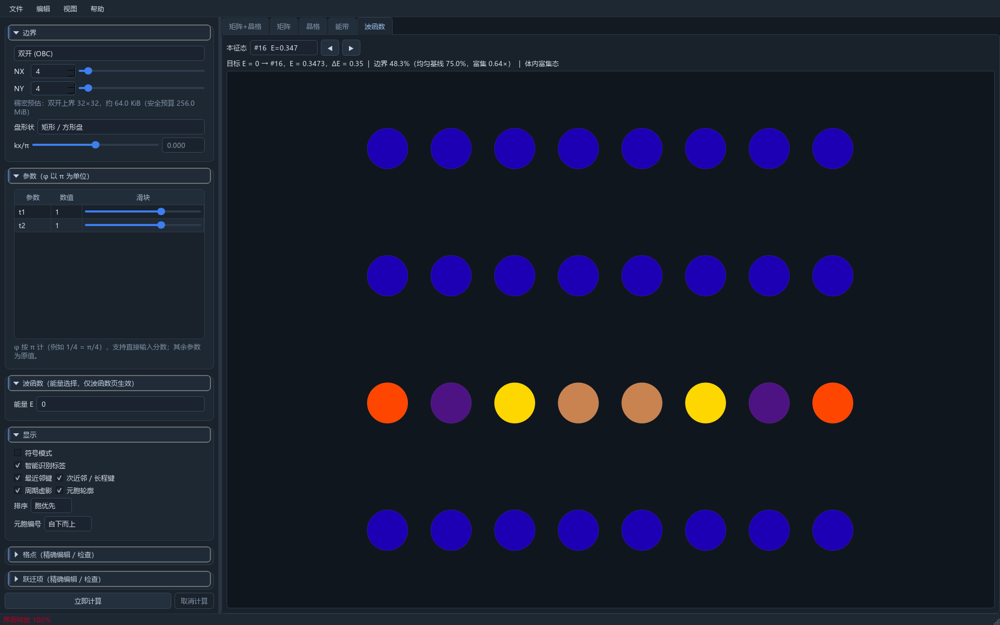

## 完整工作流教程

下面的截图均为完整窗口截图，按 100% 或实际验收倍率生成，没有使用会裁掉控件边界的局部
截图。截图资源固定存放在 `docs/assets/screenshots/`，便于在 GitHub 页面直接查看。

### 1. 选择模型、边界和尺度

从“文件 → 新建模型”选择预设，再在左侧设置边界、`NX/NY`、`kx/pi` 和参数。`NX/NY`
同时提供滑块与输入框；能带计算不因 UI 展示需要而人为收紧尺寸，但在构造稠密矩阵前会做
内存预算检查。

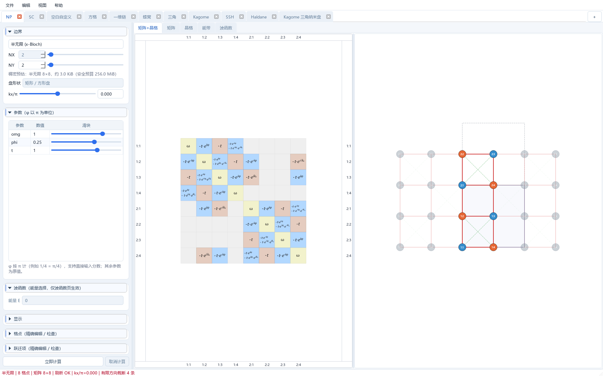

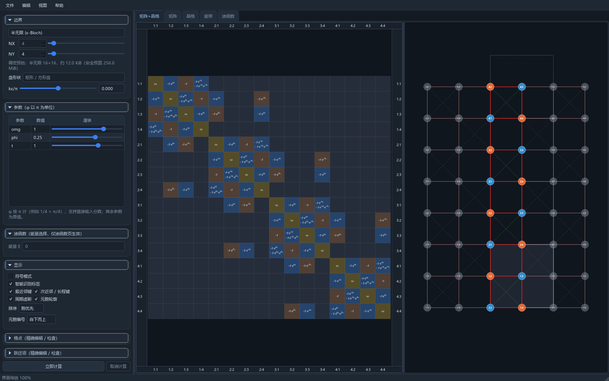

界面缩放在“编辑 → 偏好设置”中设置为 80%–180%，只改变菜单、标签、侧栏和控件，不改变
矩阵/晶格的物理视图缩放。修改后布局会重新计算，避免文字超出控件。

### 2. 调节参数和分数相位

相位 `phi` 以 pi 为单位显示，输入框接受 `1/13`、`1/4`、`pi/4` 等安全表达式并自动求值；
滑块和输入框双向同步。修改后状态栏会短暂红色提示“已输入更改，等待重新计算”，不再
遮挡画布，点击“立即计算”后旧结果才会恢复为最新。

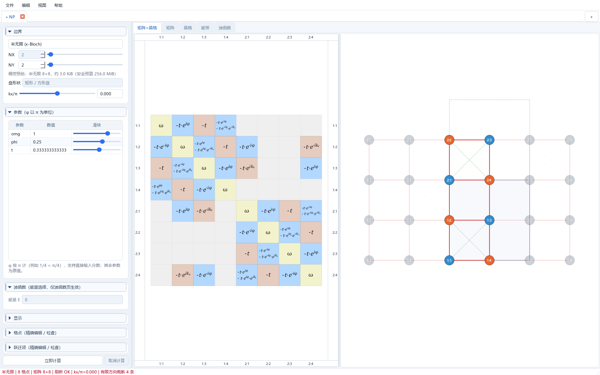

### 3. 编辑格点和元胞

点击“编辑晶格”进入编辑态。先用“添加格点”工具添加节点，再在表格中精确检查 `x/y`、
子格标签和 1-based 行号；拖动时默认吸附到当前网格间隔，按住 `Alt` 暂时关闭吸附。
斜原胞可直接编辑 `a1/a2` 长度和向量，点击“应用元胞矢量”后几何会整体重排。

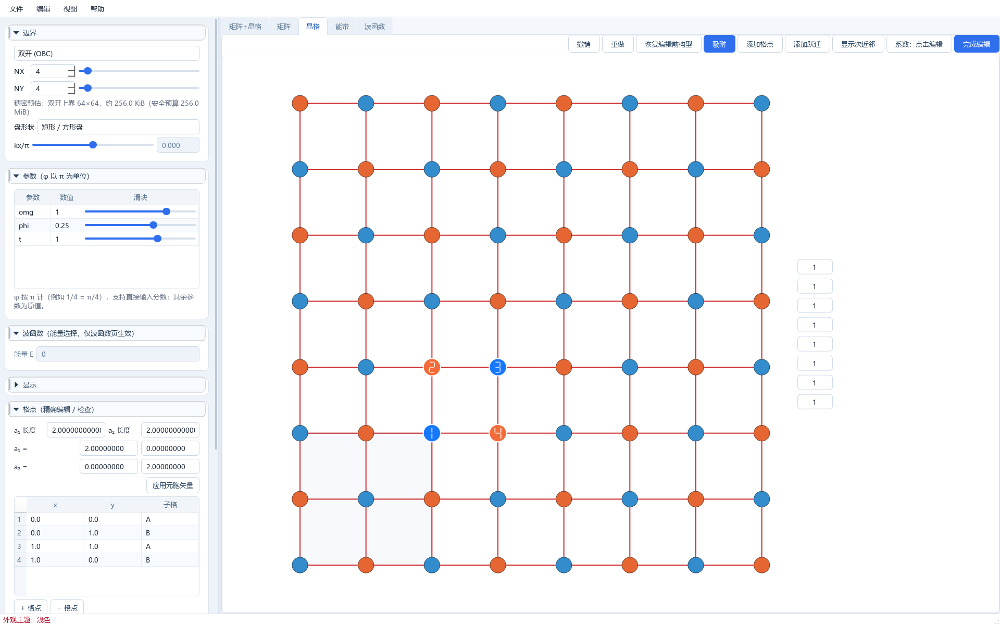

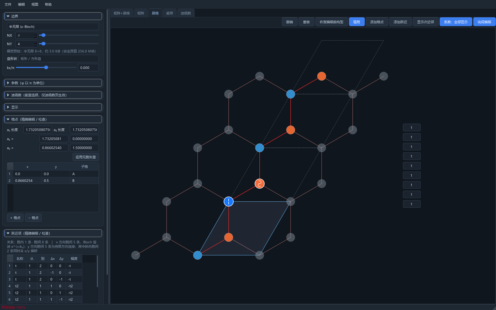

Kagome 三角盘使用 3 格点斜原胞；有限盘边界是三条平直等边，而不是索引网格的直角裁切。

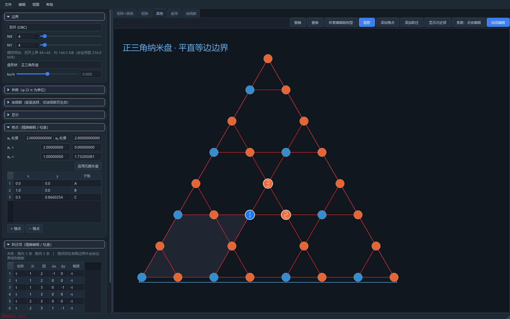

### 4. 添加胞内和胞间跃迁

点击“添加跃迁”后按提示选择起点、终点和方向。半无限模式下：

- 胞内项：`off_x=0, off_y=0`，进入同一元胞主块；
- 左右胞间项：`off_x=±1`，在 Bloch 矩阵中产生 `exp(±i*kx)`；
- 竖直/长程项：用 `off_y` 或“其他关系…”填写整数偏移；
- 幅度、相位、参数名可在右侧导轨或表格中修改。

输入框集中在右侧，只有悬停/聚焦项显示对应引线；表格仍然保留为检查和批量精确输入的兜底。

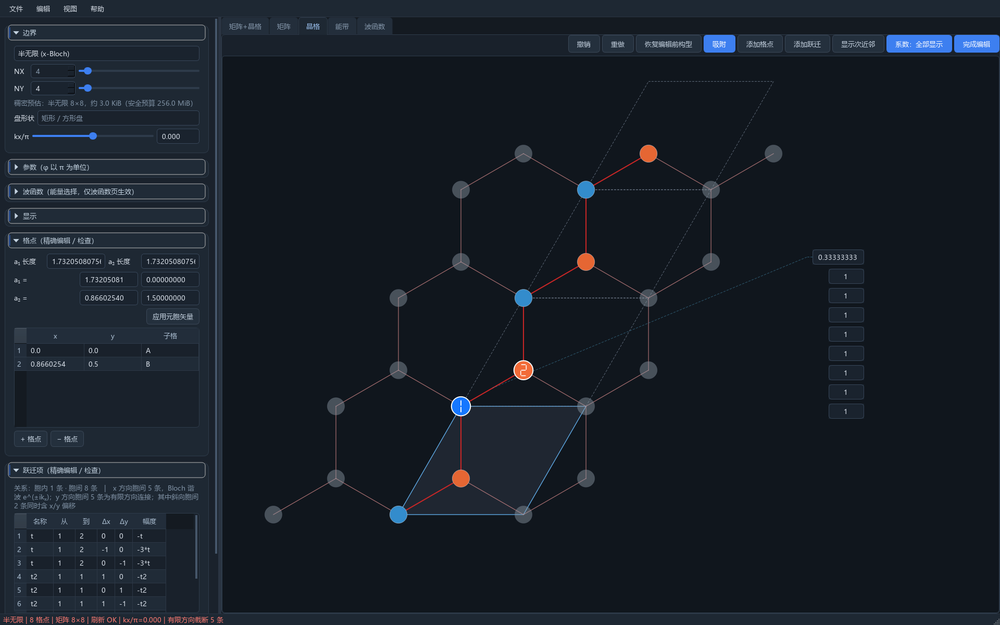

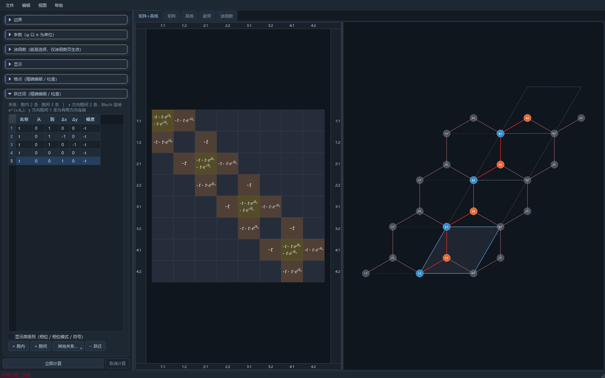

### 5. 检查矩阵和数学排版

矩阵视图的四边标尺跟随窗口边缘固定显示。滚轮或 `+` 放大，`-` 缩小，`0` 恢复适应窗口；
点击单元格只会选中，不会让整个图跟随鼠标移动。矩阵中的 `e^{ik_x}`、`e^{-ik_x}` 使用
数学字体排版，`x` 位于 `k` 的下标位置。

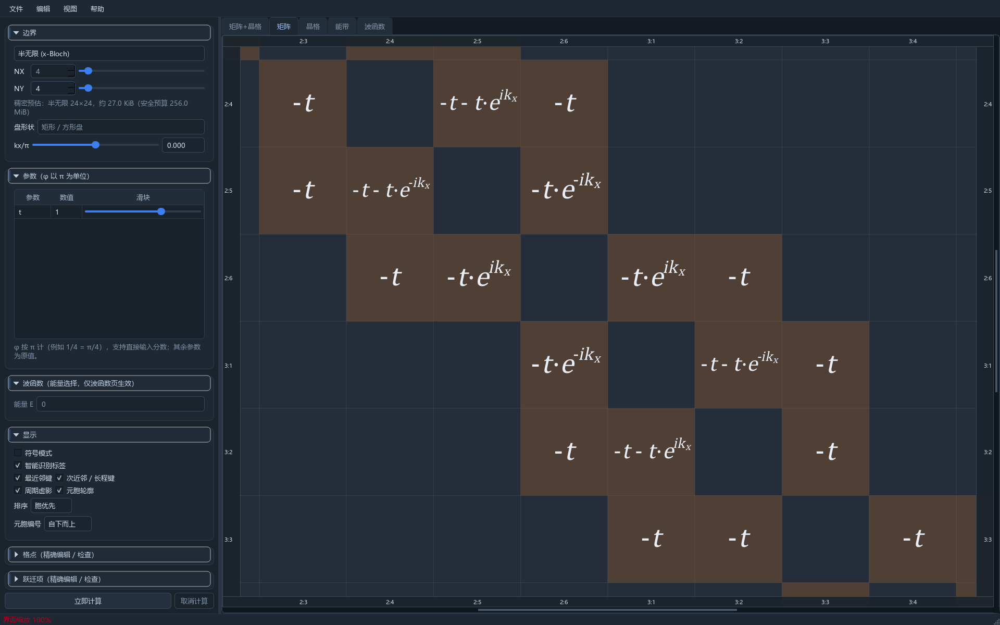

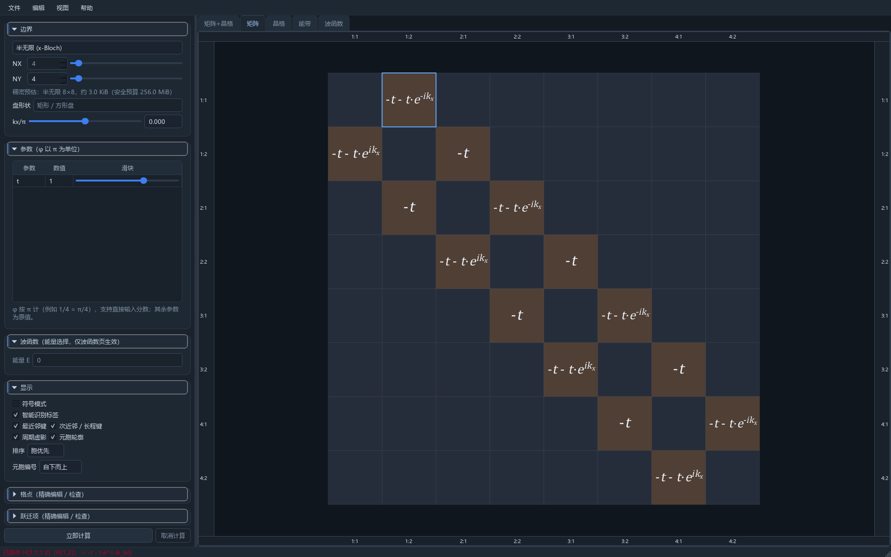

### 6. 查看能带和波函数

能带横轴固定为波矢 `k_x`，与跃迁幅度 `t` 无关；能带页会标出当前 `kx` 位置。OBC 波函数
页只在已构造有限矩阵后生效，按能量选择最近本征态，并显示归一化的 `|psi|^2` 和边界权重。

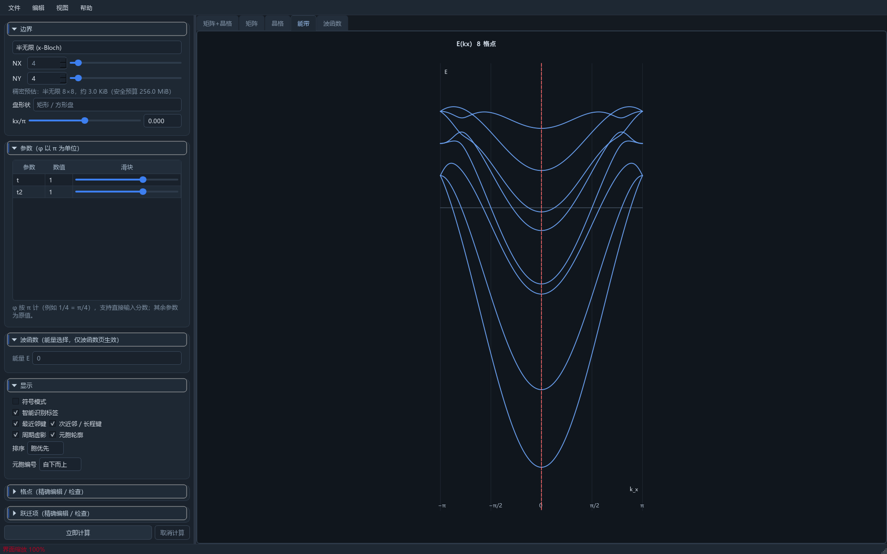

### 7. 保存、最近模型与多标签

保存后关闭标签，再从“文件 → 打开最近模型”恢复；多个标签可以拖动排序，关闭未保存模型时
会给出明确提示。需要比较时打开“视图 → 分屏比较”，或保留两个模型标签并分别查看结果。

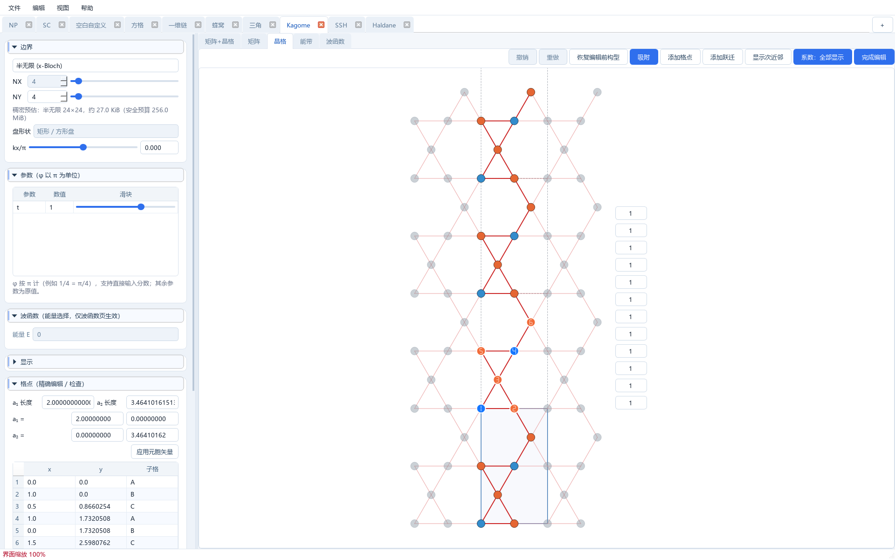

## 模型与物理语义

### 格点与元胞

每个 `Site` 的坐标必须有限、唯一，并位于 `[0,Lx) x [0,Ly)`。界面编号从 1 开始，模型
内部用连续的 0-based `site` 索引；因此表格的第 1 行对应内部 `site=0`。

一条跃迁表示：

```text
from_site in cell c  ->  to_site in cell c + (off_x, off_y)
```

用户只定义一个方向，反向 Hermitian 共轭由程序补全。负偏移、`from_site > to_site` 和长程
胞间项合法；同一物理键的等价反向副本会去重。`cell` 与 `site` 只是基底排列，必须具有
相同本征谱。

### 边界公式

半无限模式沿 x 方向采用 Bloch 展开：

```text
H(kx) = H0 + H1 exp(i*kx) + H1† exp(-i*kx)
```

晶格连线的可见编号按展开后的开边界几何绘制；矩阵计算再单独加入周期跨元胞项，两者不
混用编号。OBC 直接构造有限 Hermitian 矩阵，越过有限范围的偏移被跳过。

### 表达式

允许数字、参数名、`pi/E/I`、`+ - * / **`，以及 `sqrt/sin/cos/tan/exp/log/abs`。
属性访问、下标、导入、任意函数调用、超长或过深表达式会被拒绝。onsite 项要求为实数；
外部模型在修改 UI 前经过 schema 和表达式校验，保存使用临时文件和原子替换。

## 界面操作与快捷键

| 操作 | 作用 |
| --- | --- |
| 滚轮 | 在矩阵/晶格/能带/波函数画布缩放 |
| `+` / `-` | 以视口中心缩放 |
| `0` | 适应窗口，恢复该视图的基准缩放 |
| 左键拖拽空白画布 | 平移视图 |
| `Alt` + 拖动格点 | 临时关闭吸附，自由移动 |
| `Delete` | 编辑态删除选中格点或跃迁 |
| `Ctrl+Z` / `Ctrl+Y` | 撤销 / 重做，默认最多 10 步 |
| `Ctrl+Shift+L` | 复制当前完整矩阵为 LaTeX（`bmatrix`） |
| `Esc` | 取消正在进行的添加格点/添加跃迁工具 |

文件菜单中的“导出当前视图 PNG…”适合快速分享；“导出当前视图 SVG…”和“导出当前视图
PDF…”适合论文与报告。导出对象是当前标签页，只有计算结果处于最新状态时按钮才会启用；
系统会按当前视图比例生成单页 PDF，并自动补全对应文件扩展名。

编辑菜单中的“复制当前矩阵 LaTeX”（快捷键 `Ctrl+Shift+L`）会把当前标签页的完整矩阵复制到
剪贴板，使用可直接粘贴到 LaTeX 文档的 `bmatrix` 环境。它复用当前矩阵的符号、数值和 Bloch
相位表达式（包括 `e^{i\phi}`、`e^{\pm i k_x}`），不会重新计算或改变模型；结果过期、计算失败或
矩阵超过安全元素上限时动作会自动禁用，避免复制到过时或过大的内容。

普通点击矩阵元、节点或参数框不会启动画布拖动；需要平移时请在空白处按住左键拖动，
这能避免“点一下整个图跟着鼠标走”的误操作。

## 输入、校验与错误处理

- 所有参数输入都在失焦和提交时校验；分数、`pi` 和安全函数由受限表达式解析器处理。
- `NX/NY` 可输入较大值，能带场景不因控件而硬性限制；矩阵构造前按约 256 MiB 工作集做
  预算预检，超出时给出可恢复提示并保留模型。
- 矩阵进入 `eigh` 前检查非空、方阵、有限值和 Hermitian 误差；失败时状态栏说明原因，
  不会用旧结果冒充新结果。
- 参数或几何变化后结果标记为“已过期”；后台谱计算完成前，导出按钮保持禁用，旧任务不能
  覆盖较新的模型状态。
- JSON 导入会拒绝未知字段、重复/越界格点、非法偏移和危险表达式；读取失败不会破坏现有标签。

## 性能边界

- `kx` 单独变化走缓存快路径；能带按块构造，避免一次分配 `nk x N x N` 张量。
- 80 阶及以上谱计算进入 Qt 线程池；64 阶以上矩阵使用单张栅格图，避免创建 `N²` 个图元。
- 9–64 阶矩阵只有在单元格达到可读像素阈值后才绘制文本；大矩阵优先保证平移和缩放流畅。
- 当前后端仍是稠密矩阵。数千格点或只求少数本征态的场景，建议后续引入 SciPy 稀疏后端。

## 开发、测试与截图验收

在项目根目录执行：

```powershell
python -m pytest -q
python -m compileall hamivisualizer
```

完整测试覆盖 MATLAB 对拍、边界与负向跃迁、表达式安全、JSON、工作区恢复、所有默认预设、
矩阵/晶格/能带/波函数离屏 GUI，以及高缩放下的编辑器边界。

全预设编辑器截图审计（只写入项目内 `.codex-artifacts`，不污染系统临时目录）：

```powershell
python tools/audit_editor_scales.py
```

该脚本覆盖全部默认预设与 Kagome 三角盘、浅色/深色主题，并在 80/100/150/180% 界面
缩放下检查右侧系数框完整可见、代理几何不裁切、不互相重叠且避让格点；其中其他倍率只做
几何回归，脚本仅将 100% 结果保存为验收截图，避免混入非标准倍率证据。发布前应同时检查：

- `git diff --check` 无空白错误；
- README 中引用的 `docs/assets/screenshots/*.png` 全部存在且为完整窗口尺寸；
- `.codex-artifacts/screenshots/` 中的验收截图不应被提交，详细复拍记录写入
  `docs/持续打磨简报.md`。

## 项目结构

```text
HamiVisualizer/
├─ hamivisualizer/             # 应用源码
│  ├─ model/                   # 格点、跃迁、边界、哈密顿量、预设和持久化
│  ├─ view/                    # Qt 主窗体、矩阵/晶格/能带/波函数视图
│  ├─ controller.py            # 计算、缓存、工作区和结果状态
│  └─ tests/                   # 单元、集成和离屏 UI 测试
├─ docs/
│  ├─ assets/screenshots/       # README 使用的稳定截图
│  ├─ change-logs/             # 每次优化的中文变更记录
│  └─ 持续打磨简报.md           # 日期、证据和发布前检查汇总
├─ tools/                      # 可重复的渲染/诊断/截图审计脚本
├─ .codex-artifacts/           # 本地测试、临时数据和回归截图（已忽略）
├─ main.py                     # 源码运行入口
├─ pyproject.toml              # 包元数据和命令行入口
├─ requirements.txt            # 运行依赖
└─ README.md                   # 当前唯一正式入口
```

旧的 MATLAB 原型 `HamiltonVisualizer.m` 仅作为本地参考，已加入 `.gitignore`，不会进入后续
提交；Python 版不依赖它运行。

## 版本、变更与发布

- 应用版本遵循 SemVer：修复向后兼容问题递增 patch，新增兼容功能递增 minor，破坏模型/API
  的改动递增 major。
- 变更记录按 Keep a Changelog 的 Added/Changed/Fixed/Removed 组织，具体实现证据放在
  `docs/change-logs/`。
- 发布前至少完成：干净环境安装、完整 pytest、全预设截图审计、README 链接检查、Git 标签
  与 release note；不得把 `.codex-artifacts`、本地模型或 MATLAB 原型上传。
- 模型 JSON `version=1` 在 0.4.x 内保持兼容；未来需要迁移时应提供显式版本转换器。

## 故障排查

### 启动即提示 NumPy ABI 不兼容

确认终端中的 Python 和 pip 属于同一环境，然后执行：

```powershell
python -c "import sys, numpy; print(sys.executable); print(numpy.__version__)"
python -m pip install --force-reinstall "numpy>=1.26,<2" "PySide6>=6.6,<6.7"
```

### 画布文字太小或被隐藏

这是按像素阈值自动隐藏矩阵细节的设计。用滚轮或 `+` 放大，或按 `0` 先适应窗口后再放大；
界面缩放与画布缩放独立，改变“编辑 → 偏好设置 → 界面缩放”不会改变物理视图比例。

### 输入已改变但结果未更新

状态栏会提示结果已过期。等待防抖结束后点击“立即计算”；若后台任务失败，状态栏会保留
明确错误，修正输入后可再次计算。

### 能带/波函数按钮不可用

能带需要可计算的半无限边界，波函数需要双开边界和成功构造的有限矩阵。先确认边界模式、
格点数和跃迁表达式有效，再点击“立即计算”。

### 如何报告问题

请附上：操作系统、Python/NumPy/PySide6 版本、最小 `.hvisual` 模型、复现步骤、状态栏文字
和完整窗口截图。不要上传个人路径、系统临时目录或 `HamiltonVisualizer.m`。

## 文档规范依据

README 的结构、快速开始、帮助入口和相对截图路径参考 [GitHub README 指南](https://docs.github.com/en/repositories/managing-your-repositorys-settings-and-features/customizing-your-repository/about-readmes)。
打包元数据与 PyPI 长描述同步参考 [Python Packaging User Guide](https://packaging.python.org/en/latest/guides/writing-pyproject-toml/)
和 [PyPA README 指南](https://packaging.python.org/en/latest/guides/making-a-pypi-friendly-readme/)。
变更记录和版本规则分别参考 [Keep a Changelog](https://keepachangelog.com/en/1.1.0/)
与 [Semantic Versioning 2.0.0](https://semver.org/spec/v2.0.0.html)。
